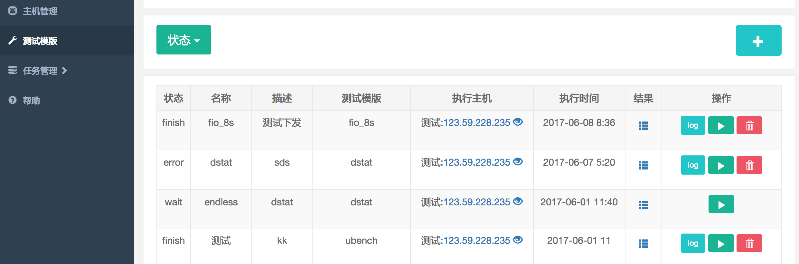

# 云主机性能测试管理平台
- - -
## Info

### 安装云主机性能测试工具，执行测试，获取执行结果。 
 
基于Django，使用Celery做异步处理任务，Fabric管理SSH连接，Redis做临时数据存储。  
wssh for 远程主机实时交互。  

- - -
## 功能模块
* 主机管理：主机IP，ssh用户名 密码  
* 测试工具和模板： 
  * 测试模版只保存工具执行的具体参数
  * 执行逻辑 
    1. 连接主机
    2. 运行工具检测命令检测是否已安装该工具
    3. 否  执行安装工具命令  
       是  跳过
    4. 执行测试命令（工具.prefix + 模版.params + 工具.suffix） 保存log
    5. 执行工具删除命令（可选）
* 任务管理：
  * 任务执行，停止，实时log显示
  * 定时任务
  * 执行历史记录，log，获取远程主机文件存为附件
  
- - -  
## 快速开始
1. Dependency  
   Redis Python2.7  MySQL
2. 克隆本项目
3. 安装依赖包  
   `pip install -r requirements.txt`
4. 启动依赖服务和celery worker  
   ```
   redis-server
   wsshd
   python manage.py celery worker --loglevel=info
   ```
5. 启动  
   `python manage.py runserver`  
   
- - -
## 示例

1. 进入主机管理，添加主机


2. 点击眼睛button，可进入实时交互界面


3. 工具管理，进入admin添加测试工具，以fio为例  


4. 配置测试模版


5. 添加测试任务，执行时可查看实时log


6. 查看测试结果,记录实际执行的shell命令


- - -
## TODO
用户／权限管理

